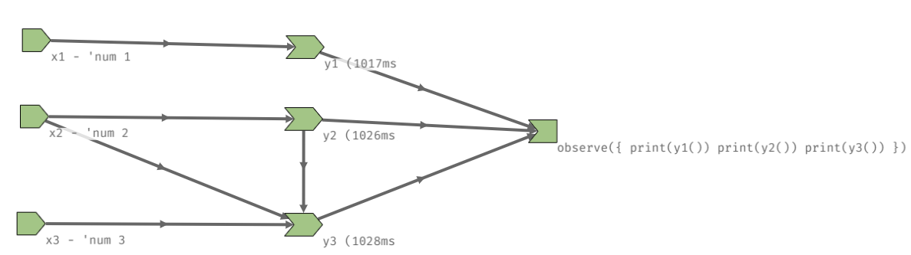

# The reactive graph

## 14.4.5 Exercises {-}

1. 

```{r, echo = FALSE}
knitr::include_graphics("img/reactive-graph.png")
```

-   Reactives are not run because there are no outputs. Server function only contains inputs and reactive expressions.

2.  The graph will take

-   1 second to recompute if `x1` changes,
-   2 second to recompute if `x2` changes and
-   1 second to recompute if `x3` changes.

Please find the reactive graph below which is generated using the [reactlog](https://rstudio.github.io/reactlog/) package. For further details, please refer to [The reactlog package](https://mastering-shiny.org/reactive-graph.html#the-reactlog-package) in  Mastering Shiny book.

```{r, echo = FALSE}

```

3.  When we start the session, `y` would not exist and thus `y()` would return an error since `y` is a reactive expression that consists of itself.
